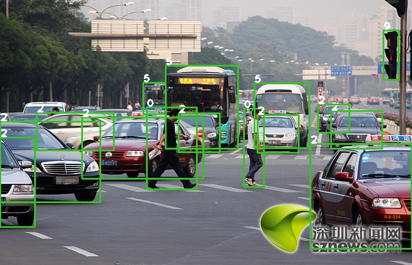
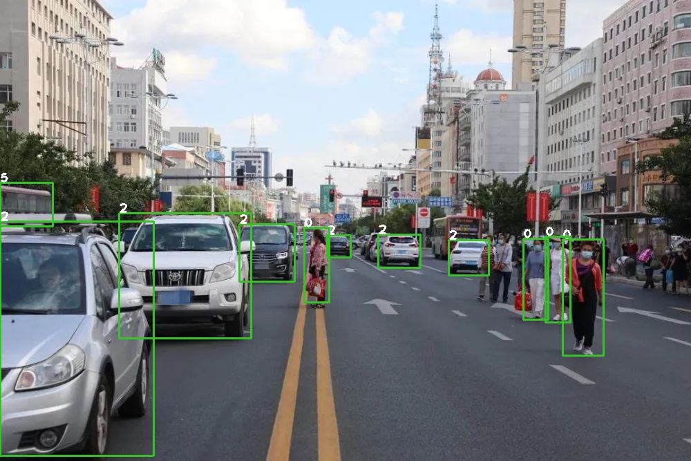

# YOLOv8 目标检测模型转 TensorRT





## 拉取tensorrtx
```bash
git clone https://github.com/wang-xinyu/tensorrtx.git
```

## 导出ONNX模型

1. 安装 `ultralytics`

```bash
# 虚拟环境安装 ultralytics
pip install ultralytics

# 安装ONNX库
pip install onnx
pip install onnxsim

```
2. 导出onnx模型

- 可以在一级 `ultralytics` 目录下，新建 `export_onnx.py` 文件
- 向文件中写入如下内容：

```python
from ultralytics import YOLO

model = YOLO("./weights/yolov8s.pt")
model.export(format="onnx")

# model = YOLO("./weights/yolov8s.pt", task="detect")
# path = model.export(format="onnx", simplify=True, device=0, opset=12, dynamic=False, imgsz=640)
```

- 运行 `python export_onnx.py` 后，会在 `weights` 目录下生成 `yolov8s.onnx`

3. 下载ultralytics源码
```bash
# 拉取源码 
git clone https://github.com/ultralytics/ultralytics.git

# 切换到ultralytics目录下
# 创建weights目录，
mkdir weights 
# 切换到weights目录下
cd weights

# 下载YOLOv8模型
wget https://github.com/ultralytics/assets/releases/download/v8.2.0/yolov8n.pt
wget https://github.com/ultralytics/assets/releases/download/v8.2.0/yolov8s.pt
wget https://github.com/ultralytics/assets/releases/download/v8.2.0/yolov8l.pt
wget https://github.com/ultralytics/assets/releases/download/v8.2.0/yolov8x.pt
wget https://github.com/lindsayshuo/yolov8_p2_tensorrtx/releases/download/VisDrone_train_yolov8x_p2_bs1_epochs_100_imgsz_1280_last/VisDrone_train_yolov8x_p2_bs1_epochs_100_imgsz_1280_last.pt
```

## 转化wts格式
```bash
# 复制gen_wts.py文件到ultralytics目录下
cp {tensorrtx}/yolov8/gen_wts.py {ultralytics}/ultralytics
# 切换到ultralytics目录下
cd {ultralytics}/ultralytics
# 运行gen_wts.py文件
python gen_wts.py -w weights/yolov8n.pt -o weights/yolov8n.wts -t detect
# yolov8n.wts文件生成

# For p2 model
python gen_wts.py -w weights/VisDrone_train_yolov8x_p2_bs1_epochs_100_imgsz_1280_last.pt -o weights/VisDrone_train_yolov8x_p2_bs1_epochs_100_imgsz_1280_last.wts -t detect
# VisDrone_train_yolov8x_p2_bs1_epochs_100_imgsz_1280_last.wts文件生成

# For yolov8_5u_det model
python gen_wts.py -w weights/yolov5nu.pt -o weights/yolov5nu.wts -t detect
# yolov5nu.wts文件生成
```
## 检测
```bash
# 切换到tensorrtx/yolov8目录下,cmake编译
cd {tensorrtx}/yolov8/
#---------------------
# 命令行生成（vscode项目生成项目可以省略）
mkdir build
cd build
cmake ..
make
#---------------------
# 复制yolov8.wts文件到build/Debug或者build/Release目录下
cp {ultralytics}/ultralytics/yolov8.wts {tensorrtx}/yolov8/build/Debug
# cmake编译项目，点击生成的yolov8_det.exe文件运行


# For example yolov8n

yolov8_det.exe -s yolov8n.wts yolov8.engine n

yolov8_det.exe -d yolov8n.engine ../images c //cpu postprocess
yolov8_det.exe -d yolov8n.engine ../images g //gpu postprocess


# For p2 model:
# 一定要修改 修改配置文件config.h中参数 "const static int kNumClass" ： 10
yolov8_det.exe -s VisDrone_train_yolov8x_p2_bs1_epochs_100_imgsz_1280_last.wts VisDrone_train_yolov8x_p2_bs1_epochs_100_imgsz_1280_last.engine x2
wget https://github.com/lindsayshuo/yolov8-p2/releases/download/VisDrone_train_yolov8x_p2_bs1_epochs_100_imgsz_1280_last/0000008_01999_d_0000040.jpg

cp -r 0000008_01999_d_0000040.jpg ../../images
yolov8_det.exe -d VisDrone_train_yolov8x_p2_bs1_epochs_100_imgsz_1280_last.engine ../images c //cpu postprocess
yolov8_det.exe -d VisDrone_train_yolov8x_p2_bs1_epochs_100_imgsz_1280_last.engine ../images g //gpu postprocess

# For yolov8_5u_det(YOLOv5u with the anchor-free, objectness-free split head structure based on YOLOv8 features) model:
yolov8_5u_det.exe -s [.wts] [.engine] [n/s/m/l/x//n6/s6/m6/l6/x6]
yolov8_5u_det.exe -d yolov5xu.engine ../images c //cpu postprocess
yolov8_5u_det.exe -d yolov5xu.engine ../images g //gpu postprocess
```
